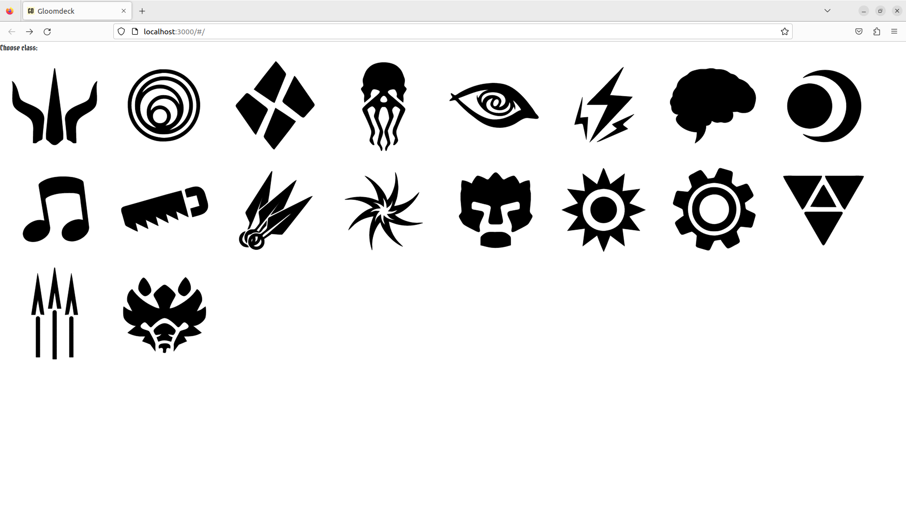

# Gloomdeck - deck builder for Gloomhaven

## Run locally

```
yarn start
```

## Build

```
yarn build
```

and build files should be available in `./build/` directory. Size may reach 200MB due to images of cards.

## Screenshots

Choose character screen


---

Deck list view


---

Card preview on the list


---

Filtering cards

